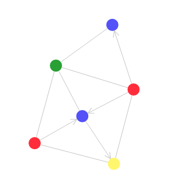

# Yellow



Welcome to Yellow! Yellow is a project for rendering graphs in web
pages. Yellow provides react components to easily render a graph. For
example, the above graph could be rendered by:

```
import { Graph, CircleNode, Edge } from '@akud/yellow-client';

<Graph>
  <CircleNode nodeId="red-node-1" color="#fc2f38" />
  <CircleNode nodeId="red-node-2" color="#fc2f38" />
  <CircleNode nodeId="blue-node-1" color="#5b41fc" />
  <CircleNode nodeId="blue-node-2" color="#5b41fc" />
  <CircleNode nodeId="yellow-node" color="#fcf95d" />
  <CircleNode nodeId="green-node" color="#3ba226" />
  <Edge fromNodeId="red-node-1" toNodeId="yellow-node" />
  <Edge fromNodeId="red-node-1" toNodeId="blue-node-1" />
  <Edge fromNodeId="red-node-1" toNodeId="green-node" />
  <Edge fromNodeId="red-node-2" toNodeId="yellow-node" />
  <Edge fromNodeId="red-node-2" toNodeId="blue-node-1" />
  <Edge fromNodeId="red-node-2" toNodeId="blue-node-2" />
  <Edge fromNodeId="red-node-2" toNodeId="green-node" />
  <Edge fromNodeId="blue-node-1" toNodeId="green-node" />
  <Edge fromNodeId="blue-node-1" toNodeId="yellow-node" />
  <Edge fromNodeId="blue-node-2" toNodeId="green-node" />
</Graph>
```

Yellow is still in its infancy. It will grow over time. Expect to see
it used on my blog, [/alexkudlick.com/blog](http//alexkudlick.com/blog).

[](https://lernajs.io/)
